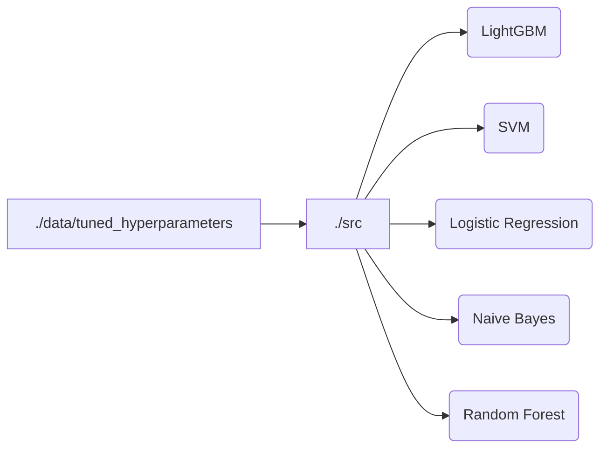

# DNA-structure-prediction
Accurate Prediction of DNA structure from its sequence using Machine Learning
Gupta, Abhijit; Kulkarni, Mandar; Mukherjee, Arnab (2020): Accurate Prediction of B-form/A-form DNA Conformation Propensity from Primary Sequence: A Machine Learning and Free energy Handshake. ChemRxiv. Preprint. https://doi.org/10.26434/chemrxiv.12599633.v2 

# Workflow diagram

