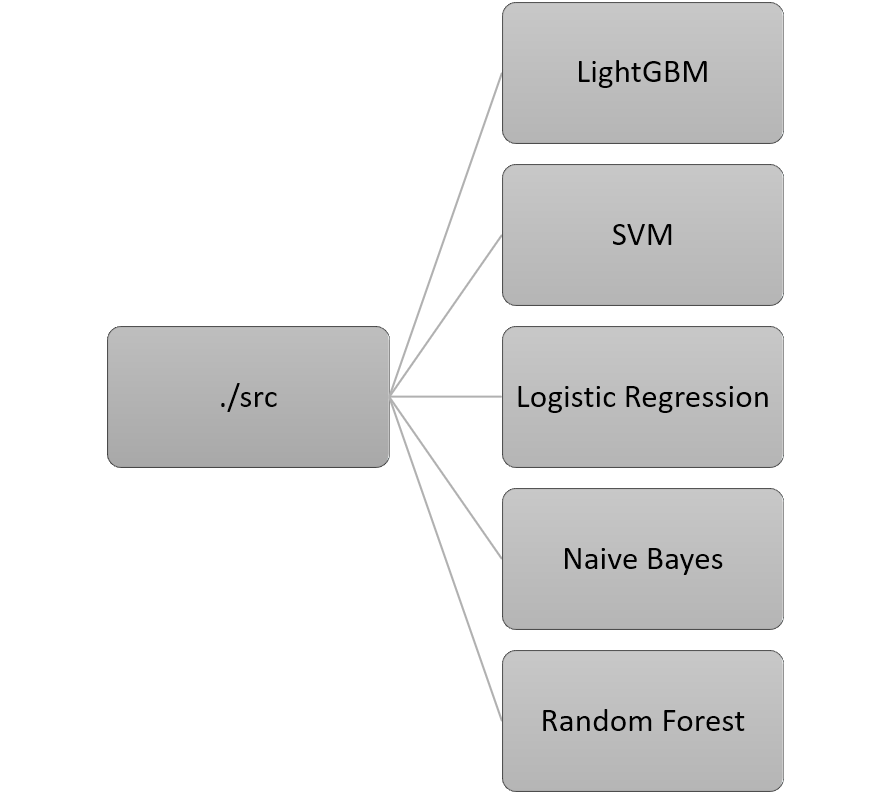

# DNA-structure-prediction
Accurate Prediction of DNA structure from its sequence using Machine Learning
Gupta, Abhijit; Kulkarni, Mandar; Mukherjee, Arnab (2020): Accurate Prediction of B-form/A-form DNA Conformation Propensity from Primary Sequence: A Machine Learning and Free energy Handshake. ChemRxiv. Preprint. https://doi.org/10.26434/chemrxiv.12599633.v2 

# Workflow diagram
The **src** directory contains the different machine learning algorithms that we tested using 5-fold nested cross validation strategy

  

The **utils** directory has two modules "NestedCV" and "Evaluator". "NestedCV" contains two generator functions, which provide implementation of nested cross-validation. The gen_data implements the "outer loop" by doing k-fold Stratified cross-validation. It also provides the option for performing SMOTE+Tomek on the training data. At each iteration it yields a dictionary of a pair of "train" and "test" samples.
The "inner loop" is implemented by another generator function named "gen_data_for_tuningHP". It takes the "train" data from an iteration of the outer loop and splits it into "inner train data" and "validation" data. It then performs the inner stratified k-fold cross-validation for tuning hyperparameters of an algorithm. 

The next module, **Evaluator** is used for training and evaluation. It generates the "ROC-AUC" and "Precision-recall" graphs and outputs a dataframe that contains the result of performing nested cross validation. It also performs the classification by choosing the optimal threshold and then converting the class probabilities into the class labels.